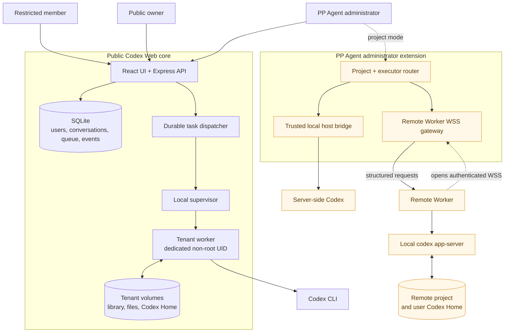
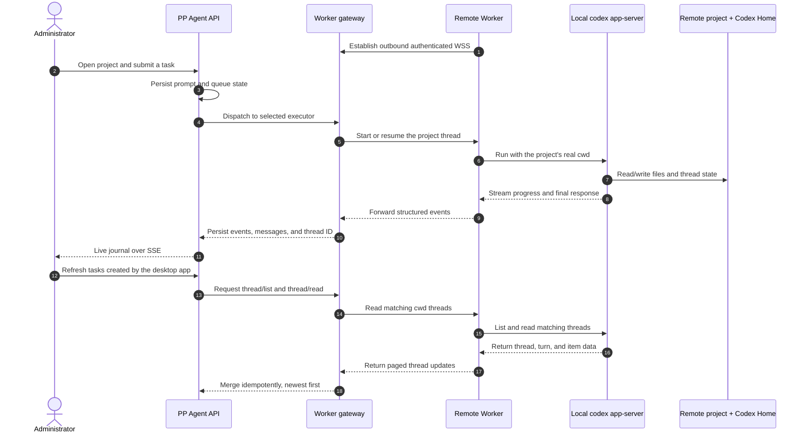
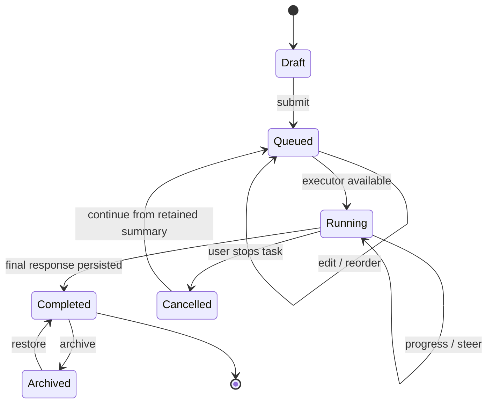

# Codex Web

An unofficial, self-hosted web workspace for the OpenAI Codex CLI. It adds persistent conversations and unsent drafts, file uploads and deliverables, side-by-side in-page previews for generated files, server-side task queues with an optional skip-the-queue immediate start, live steering, resumable interruption history, conversation archiving, time-filtered bulk import of local sessions, automatic titles, self-service username and password changes, adjustable reading size and chat column width, light/dark/system appearance modes, per-provider/model token, cache-hit, and estimated-cost billing analytics with manual or JSON-synced pricing rules, user-managed preset prompts with default-on and per-conversation toggles, and optional voice transcription.

> Codex Web is an independent community project. It is not affiliated with, endorsed by, or supported by OpenAI.

[中文说明](README.zh-CN.md)

## What it includes

- A responsive React chat interface for Codex CLI
- Persistent side-chat history with multiple independent threads per primary conversation, cross-task pinning, task-aware reopening, an independently resizable desktop pane, one-click primary-context snapshots, completed-turn Fork into a side chat, per-thread model/reasoning selection, and source quotes resolved to rollout JSONL path, line, byte offset, JSON Pointer, item ID, and character range
- Server-persistent queued prompts with reorder, edit, delete, and steer actions; queued jobs can also be promoted to start immediately
- Edit and resend completed user turns from the browser; the server forks the Codex thread before that turn, keeps the superseded branch for audit, and hides it from the active conversation
- Fork the latest completed primary-conversation turn from the persistent header, or fork through any loaded completed assistant answer; the side chat copies visible history through that turn and creates its independent Codex thread on first send with `lastTurnId`
- Persistent attachments and generated deliverables
- Side-by-side in-page previews for Markdown, code, config (JSON/YAML/TOML/XML and other text-based formats), text, CSV, PDF, and image outputs, with a per-conversation output-file strip; long per-answer output lists show three files by default, prioritize Markdown, and can be expanded in bounded batches so large file sets do not create a huge DOM at once; uploaded `.md` attachments are recognized by extension and rendered as Markdown in the same panel; every attachment and output shows its real server path with a copy button, including referenced local files that were not registered as attachments
- Clickable `file:line` references in assistant replies open a lazy-loading code preview centered on the referenced line
- Local code file paths without a line number are also clickable and open the same preview from the top of the file with downward lazy loading; `.md`/`.markdown` files render as a full Markdown preview instead, even when referenced with a line number
- Previous/next “my message” jump controls anchor to the viewport and auto-load older pages until the target user message is located
- Temporary unauthenticated share links for previewable output files (HMAC-signed, 7-day expiry, outputs only)
- Server-persistent unsent text, quotes, and attachments, restored across conversations, browsers, and devices
- Codex thread persistence across browser restarts, including durable turn IDs used for history editing and resend
- Subagent execution through Codex app-server, with child-agent operations and status shown in the live work journal
- Import existing local Codex CLI sessions (rollout files in the executor's `sessions/` and `archived_sessions/`) as web conversations, then continue them from the browser
- Optional multi-provider management with a "source · model" picker: native Responses providers remain direct, while Chat Completions-only providers can run through a per-task bundled `codex-relay`; management is disabled by default per user and supports source/model visibility plus task-level switching through app-server `modelProvider` (see [docs/PROVIDER_MANAGEMENT.md](docs/PROVIDER_MANAGEMENT.md))
- API usage and billing analytics from completed turns, grouped by provider and model, with input/output/cache token totals, cache-hit rate, configurable valley/peak per-million-token rules, rate history, and a full-history reprice action
- User-managed preset prompts: create, edit, and delete named rules from account settings, mark presets as default-on so new conversations start with them enabled, and toggle them per conversation in a collapsible panel below the composer; enabled prompts are appended to every task automatically
- Soft-deleted conversation audit records while workspace files are removed
- Archive and restore completed conversations without deleting their history or files
- Cancellation that retains a concise history of completed work so the next turn can resume from it
- Explicit interrupted-task messages after an unexpected service restart, without unsafe automatic retries
- Graceful container shutdown that drains in-flight Codex work and leaves queued tasks persisted
- Automatic short task titles, with manual titles taking precedence
- A durable live work journal with retained stage feedback and grouped command steps
- Running work journals expand inline with the page instead of creating a nested vertical scroller
- Unread-result markers for completed conversations until their detail is viewed
- Distinct running and queued indicators with a visible queue position (how many jobs are ahead in the shared working directory), a skip-queue action while waiting, plus a stable overflow menu for task actions
- A 500 MiB Codex rollout warning that suggests archiving very long conversations
- Light, dark, and system-following appearance modes
- Select message text and attach it as a removable, server-persisted reference to a new Agent question
- Load only the latest 30 messages initially, then fetch older pages at the top without moving the reader's position
- Optional Alibaba Cloud DashScope voice transcription
- Bounded transcription context from drafts, attachment names, text-file heads, recent messages, and a small number of images
- A fixed mobile app shell with inner scrolling for more reliable iPhone/iPad Safari behavior
- A dedicated Unix identity for the Codex worker inside the container
- A managed local spreadsheet skill backed by the pinned openpyxl/pandas runtime; detailed Excel rules are injected only for matching attachments
- Optional Apps, connectors, Goals, and multi-agent features remain off unless the conversation explicitly asks for them

## How the system fits together

Codex Web is the reusable, self-hosted core of a larger personal Agent workstation design. The core turns the Codex CLI into a durable web service: the browser can disappear, but conversations, drafts, queued prompts, attachments, progress events, thread IDs, and finished files remain on the server.

The full PP Agent deployment pattern adds a second execution tier for an administrator. Restricted member accounts still run inside isolated Docker tenants, while the administrator can route project work either to a trusted server-side executor or to a Remote Worker on another computer. This repository intentionally ships only the low-privilege public core as a safe default; the administrator host bridge, project mode, Remote Worker gateway, and production provisioning are extension components, not turnkey public settings.

### Roles and execution boundaries

| Role | Execution location | Accessible state | Intended use |
| --- | --- | --- | --- |
| Restricted member | Non-root tenant worker inside Docker | Its own conversations, library, uploads, outputs, and Codex Home | A friend or team member who should not access the host or another tenant |
| Public owner | The same isolated tenant model | Its own self-hosted workspace and service settings | The default single-owner setup in this repository |
| PP Agent administrator | Explicitly selected local or remote project executor | Projects the administrator has added, plus their retained task history | Managing trusted server projects and Codex sessions on connected computers |



The important boundary is the executor, not the browser account alone. A restricted account cannot turn a web request into host access: its job is validated, handed to a fixed Unix identity, and confined to that tenant's paths. Administrator project mode is a separate, explicit trust decision and is therefore kept out of the public default deployment.

### Changing your username and password

Open the account settings at the bottom-left of the sidebar, choose **Account & password** and click **Edit** to open the account dialog. You can change your login username and password there. Both changes require your current password. New passwords must be at least 12 characters, and changing your password immediately revokes sessions on other devices. In the default container/tenant deployment, usernames can be changed from the UI and persist across restarts instead of being reset by the `.env` seed. In host mode every web username maps to a real system account, so the username cannot be changed from the web; users can still rotate their web login password there, while the system account password is managed with `passwd`.

### Remote computer execution

A Remote Worker does not expose an inbound shell, RDP endpoint, or generic tunnel. It initiates an application-level WSS connection to the server, advertises its runtime capabilities, and executes only requests addressed to a registered project. Codex runs under the interactive user on that computer, with the real project directory as `cwd` and that user's normal Codex Home, so web-started and desktop-started threads share the same local Codex history.



Remote synchronization is deliberately explicit rather than pretending to be a distributed filesystem. Thread, turn, and item identifiers make imports idempotent; offline machines keep their project history visible, while new work waits until the executor is available. An archived project is hidden without deleting its tasks and stops receiving explicit synchronization until the same executor and folder are added again.

### Durable task lifecycle

The browser is a control surface, not the owner of task state. Drafts and their attachments are saved before submission; queued prompts can be edited, reordered, deleted, or converted into live steering. Different conversations may run concurrently, while each conversation remains serial. Progress is compacted into a bounded journal with important stage feedback retained; the journal grows with the main page and disappears when the final Agent response is stored.



This architecture separates four kinds of durable state:

- application state in SQLite: identities, sessions, conversations, messages, drafts, jobs, events, ordering, and thread references;
- tenant knowledge and files: each user's library, uploads, outputs, and immutable deliverables;
- Codex state: login credentials and thread history inside the executor's own Codex Home;
- runtime state: short-lived per-job directories and processes that can be reconstructed after a restart.

For the public build, the web process has no Docker socket, host filesystem mount, or root bridge. See [Architecture](docs/ARCHITECTURE.md) and [Security](docs/SECURITY.md) before adapting the extension pattern to your own environment.

## Requirements

- Docker Engine with Docker Compose v2
- At least 4 GB RAM; 8 GB is recommended for document-heavy tasks
- A Codex account that can sign in through the Codex CLI
- Node.js 22+ only if you want to run the test suite or password helper locally

## Quick start

1. Copy the configuration template:

   ```bash
   cp .env.example .env
   ```

2. Install development dependencies and generate a password hash:

   ```bash
   npm ci
   npm run hash-password -- 'choose-a-long-unique-password'
   ```

3. Put the generated hash in `APP_PASSWORD_HASH`, set a random `SESSION_SECRET` of at least 32 characters, and adjust `APP_USERNAME` and `APP_DISPLAY_NAME` in `.env`.

4. Build and start the service:

   ```bash
   docker compose up -d --build
   ```

5. Sign the isolated owner worker into Codex:

   ```bash
   docker compose exec --user 11001:11001 \
     -e HOME=/app/tenants/00000000-0000-4000-8000-000000000001 \
     -e CODEX_HOME=/app/tenants/00000000-0000-4000-8000-000000000001/codex-home \
     app codex login --device-auth
   ```

   To reuse the host machine's existing Codex login and model catalog instead of
   signing in manually, see "Reusing the host Codex login" in
   [Deployment](docs/DEPLOYMENT.md).

6. Open [http://localhost:37821/codex-web/](http://localhost:37821/codex-web/).

State is stored in Docker named volumes. Closing the browser does not remove queued work, attachments, unsent composer drafts, or archived conversations.

## Host mode without Docker

Codex Web can also run directly on the host as root. In this mode every machine
user is a tenant: tasks run under that user's Unix identity with
`workspace-write`, `approval_policy = "on-request"`, and
`approvals_reviewer = "auto_review"`. The selected working directory, conversation
workspace, and tenant library are writable without a browser approval prompt; operations that need
additional access are reviewed automatically and fail closed when no automatic
decision is available. When the operator sets `ALLOW_DANGER_FULL_ACCESS=true`,
each conversation can also opt into Codex's `danger-full-access` sandbox from
the composer: sandboxing is then skipped entirely and the agent gets the tenant
user's full filesystem and shell access, with no approval review. `CODEX_HOME` points at the user's real `~/.codex`, so
their global skills and reviewed host tools remain available. `add-tenant.mjs` creates missing
system users (copying a `.codex` template) and reuses existing users' own
`~/.codex`. Task processes load the user's full supplementary groups via
`setpriv --init-groups` (util-linux), so group-owned host tools work as in a
normal login. See [Host mode](docs/DEPLOYMENT.md#host-mode-machine-users-as-tenants)
for setup and the security trade-offs.

In host mode, a new task can choose its Codex working directory: pick one of
your saved favorite directories, browse the machine's filesystem from the
dialog, or type any absolute path the machine user can access. The same path
browser is available when adding attachments: files on the machine can be
selected directly and are copied into the conversation's isolated workspace.
Favorites and a per-user default are stored in the web database, and each
conversation remembers its own directory. Attachments, generated outputs and
temporary runtime files still live in the conversation's own workspace;
deleting a conversation never removes the selected host directory. Tasks that
share one directory run one at a time to avoid conflicting writes. Switching an
existing conversation into a directory where other sessions have queued or
running work asks for your confirmation first, and proceeds once you confirm.
The sidebar groups these tasks by working directory: standalone workspaces,
and every favorite or unfavorited directory becomes its own category
(unfavorited directories use the directory name). You can create custom
categories, move a directory into one, pin categories, reorder pinned
categories, and hide categories you do not want in the sidebar; category
definitions, directory assignment, pin order, and hidden categories are
persisted on the server while expanded/collapsed state stays in the browser.
Inside a category, tasks default to most-recently-active first. You can
long-press and drag its tasks to choose a persistent custom order (normal
swiping still scrolls the list); tasks created after a saved order stay visible
at the top until you drag them again. The first startup after the task-order
fix clears legacy saved drag orders once so an upgrade cannot preserve an order
created by older accidental gestures.
From a category's action menu you can also start a new task directly in that
category's working directory; custom categories with several directories ask
you to pick one first. Hidden categories can be restored from the category
manager. The sidebar offers both a vertical list and a grid view; in grid view
each card is a category with its tasks, and “N more” expands the card to show
all tasks. The expand/collapse control can also be pressed and dragged up or
down to pick how many tasks each category shows; the per-category count is
remembered in the browser. Cards are laid out
in priority order from top-left to bottom-right: the first row fills left to
right, then each card joins the column with the smallest current height (ties
go to the leftmost column), so cards with different heights no longer leave
uniform row gaps. When one screen cannot hold every card, the grid
automatically widens into additional columns, bounded by the sidebar width,
and falls back to vertical scrolling when the width is too narrow. The view
choice is stored in the browser. This feature is deliberately unavailable in
the isolated tenant deployment.

## Optional voice transcription

Set `DASHSCOPE_API_KEY` and an HTTPS `PUBLIC_BASE_URL` in `.env` to enable the microphone button. The default model is `qwen3.5-omni-plus`; you can override it with `DASHSCOPE_ASR_MODEL`. Microphone access requires a secure browser context.

Audio is uploaded to your server first and then sent to the DashScope endpoint configured by `DASHSCOPE_BASE_URL`. Leave the key empty to disable the feature completely.

The optional spelling/topic context is bounded to about 500 tokens by default and shared across the draft, attachment names, the first 16 KiB of text attachments, recent messages, fixed technical terms, and up to two small images. Large unsent files are never copied wholesale into the transcription request. Tune the limits with `TRANSCRIPTION_CONTEXT_TOKEN_BUDGET`, `TRANSCRIPTION_CONTEXT_MAX_IMAGES`, and `TRANSCRIPTION_CONTEXT_MAX_IMAGE_BYTES`.

## Reverse proxy

The container binds to loopback by default. Proxy `/codex-web/` to `http://127.0.0.1:37821/codex-web/` and preserve WebSocket/SSE-friendly buffering settings. See [Deployment](docs/DEPLOYMENT.md).

## Usage and billing

On desktop, click **API usage and billing** in the top bar (the mobile layout does not show this button) to review 7/30/90/365-day input, output, and cache token totals, cache-hit rate, and estimated cost grouped by provider and model. Prices are configured per million tokens for uncached input, cache reads, cache writes, and output. The usage event reports total input tokens, so uncached input is calculated as `max(input_tokens - cached_input_tokens - cache_write_input_tokens, 0)` before applying the input price. The regular values are used as valley prices by default; each model can optionally define peak prices, a daily peak window (including cross-midnight windows), applicable weekdays, and an IANA timezone. When a price changes, the prior rule remains effective for usage before the change and the new rule is used afterward. The **force reprice** action clears those rule versions and applies the current rule to all historical usage, which is useful for correcting an initially wrong price. Opening the panel only reads local pricing rules and does not request remote configuration; click **sync remote pricing** to explicitly try compatible pricing endpoints for every enabled provider, prioritizing New API `/api/pricing` and `/api/ratio_config`. Because upstreams do not share one pricing API, sync only imports responses that expose a model plus input/output token prices. Calls without a configured rule remain visible but are deliberately excluded from estimated cost.

## Development

```bash
npm ci
npm test
npm run dev
```

The default development URL is `http://127.0.0.1:5173/codex-web/`.

## Security model

Codex runs as a dedicated non-root Unix user. The web process can coordinate that worker through a local supervisor but the public edition has no Docker socket, no host filesystem bridge, and no host-root execution path. Review [Security](docs/SECURITY.md) before exposing an instance to the internet.

## License

[MIT](LICENSE)
