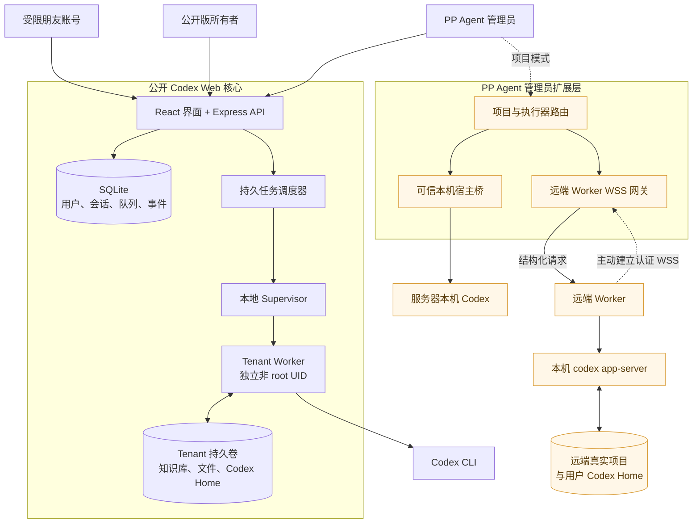
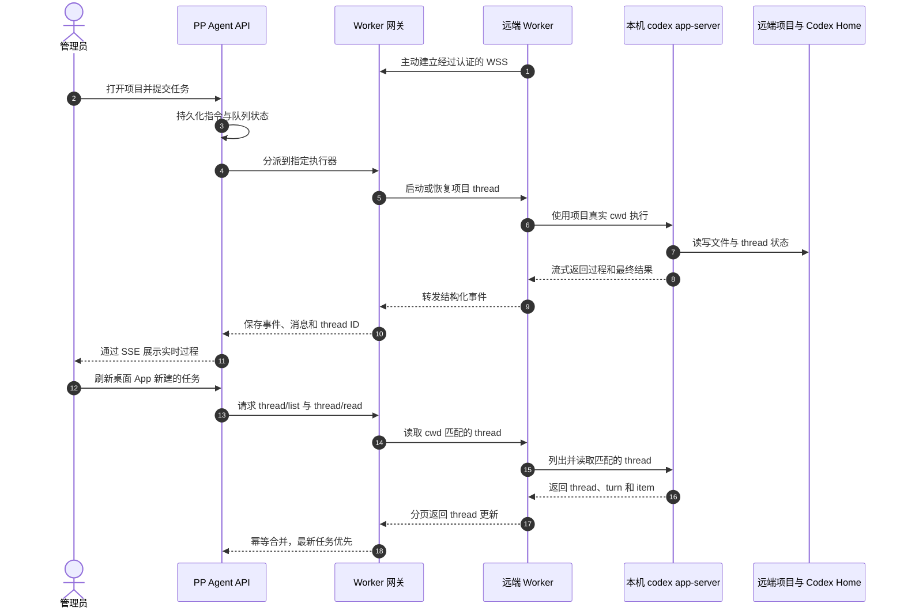
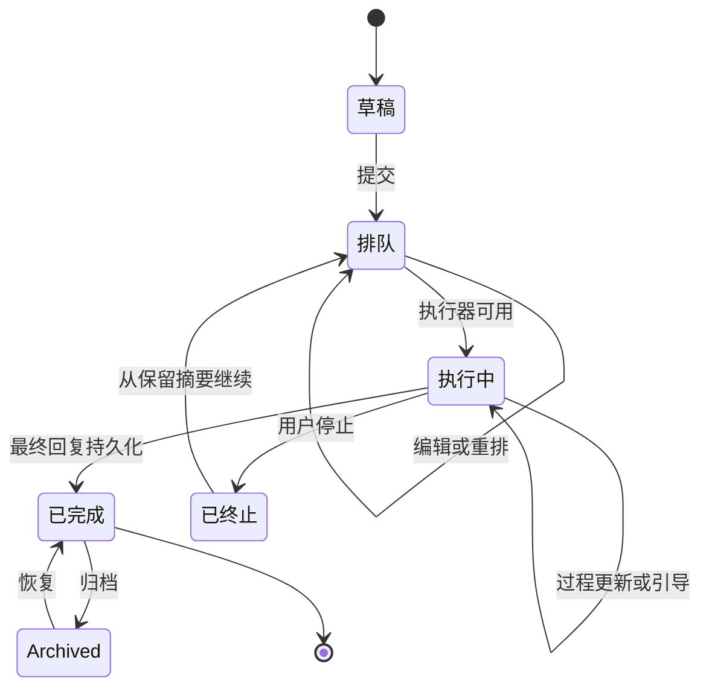

# Codex Web

Codex Web 是一个非官方、自托管的 OpenAI Codex CLI 网页工作台。它提供持久化会话、未发送草稿、附件与交付文件、结果文件并排页内预览、服务器端任务排队、实时引导、可续接的终止/中断记录、会话归档、按时间筛选的批量历史会话导入、完整工作记录、完成任务未读提示、引用提问、自动命名、用户名与密码自助修改、字号与聊天区宽度调节、多 API 源与“源 · 模型”菜单管理，以及可选的语音转写。源管理说明见 [docs/PROVIDER_MANAGEMENT.md](docs/PROVIDER_MANAGEMENT.md)。

> 本项目由社区独立开发，与 OpenAI 没有关联，也未获得 OpenAI 的背书或支持。

## 快速开始

环境要求：Docker Engine、Docker Compose v2，以及可登录 Codex CLI 的账号。

```bash
cp .env.example .env
npm ci
npm run hash-password -- '请设置一个至少十二位的独立密码'
```

把生成的哈希填入 `.env` 的 `APP_PASSWORD_HASH`，并设置至少 32 个字符的随机 `SESSION_SECRET`。然后执行：

```bash
docker compose up -d --build
docker compose exec --user 11001:11001 \
  -e HOME=/app/tenants/00000000-0000-4000-8000-000000000001 \
  -e CODEX_HOME=/app/tenants/00000000-0000-4000-8000-000000000001/codex-home \
  app codex login --device-auth
```

打开 [http://localhost:37821/codex-web/](http://localhost:37821/codex-web/) 即可使用。队列、附件、会话、归档记录、Codex 线程，以及输入框中尚未发送的正文、引用和附件都保存在服务器端；切换会话、关闭浏览器或换设备后仍可继续编辑。

运行中的工作记录不再形成独立的纵向滚动区，而是按照现有记录上限随页面自然展开。排队与运行状态使用不同图标；任务操作收进稳定的菜单。用户终止任务后，关键执行过程会保留为历史消息；服务意外重启也会明确标记未完成任务，避免把中断误认为完成或自动重复执行。容器正常停止时会等待在途任务结束，已排队任务继续保存在服务器。

已完成的会话可以无损归档和恢复；当 Codex rollout 达到 500 MiB 时，界面会提示新建任务以控制超长上下文成本。移动 Safari 使用固定应用外壳，只让内容区滚动。本地 Excel 附件由托管的 openpyxl/pandas 技能处理，详细 Excel 规则只在本轮确实包含对应附件时注入。Apps、连接器、Goals 和多代理能力默认关闭，仅在用户明确提出时启用。

每个任务会维护一个“输出文件”横条，任务生成的 Markdown、纯文本、CSV、图片和 PDF 可以直接在对话窗口右侧展开的并排预览面板中查看；文本类预览超过 5 MiB 时会退化为下载，避免大文件占用浏览器内存。

消息中的附件卡片、输出文件横条和预览面板都会显示文件在服务器上的真实路径，并提供一键复制按钮；回复中引用了但未登记为附件的本机文件也会展示原始路径（不可下载），方便定位与手动打开。

对话中出现的“文件:行号”引用（包括行内代码、Markdown 链接与 Codex 文件引用）会渲染为可点击的代码引用；点击后右侧打开代码预览，定位到对应行并展示上下文，向上或向下滚动时会按需懒加载更多代码。

消息列表右下角提供“上一条/下一条我的消息”快速跳转：以当前视口位置为锚点定位相邻的用户消息，更早历史尚未加载时会自动翻页加载直到定位到目标，并短暂高亮该消息。

## 这套工程解决什么问题

Codex Web 是个人 Agent 工作站中可复用、可公开部署的核心。它把一次性的 Codex CLI 交互变成持久服务：即使关闭浏览器，会话、草稿、待发送任务、附件、过程事件、Codex thread ID 和最终文件仍保存在服务器上，换设备后也能继续。

完整的 PP Agent 部署会在这个核心之上增加管理员执行层：朋友或普通成员继续在彼此隔离的 Docker tenant 中运行；管理员则可以按项目明确选择服务器本机执行器，或选择另一台电脑上主动连入的 Remote Worker。为了让公开版本保持安全默认值，本仓库只直接发布低权限核心；管理员宿主桥、项目模式、远端 Worker 网关和生产账号配置属于扩展组件，并不是克隆本仓库后自动启用的功能。

### 账号角色与执行边界

| 角色 | 任务在哪里执行 | 可以访问什么 | 适用场景 |
| --- | --- | --- | --- |
| 受限朋友账号 | Docker 内的非 root tenant worker | 仅自己的会话、知识库、附件、输出和 Codex Home | 允许朋友使用 Agent，但不能接触宿主机或其他用户数据 |
| 公开版所有者 | 同样使用隔离 tenant | 自己的工作区与服务配置 | 本仓库默认的单所有者自托管方式 |
| PP Agent 管理员 | 明确选择的本机或远端项目执行器 | 管理员主动添加的项目及其历史任务 | 管理可信服务器项目，以及已连接电脑上的 Codex |



这里最重要的安全边界是“执行器”，而不只是浏览器账号。受限账号不能把普通 Web 请求变成宿主机访问：任务先经过路径和用户校验，再交给固定 Unix 身份，只能触达自己的 tenant。管理员项目模式则代表一次额外、明确的信任选择，所以它不会混进公开版的默认部署。

### 修改用户名与密码

登录后展开左下角“个人设置”，点击“账户与密码”中的“修改”，在弹出的对话框中即可修改自己的登录用户名与密码。两种修改都需要验证当前密码。新密码至少 12 个字符；修改密码后，其他设备上已登录的会话会立即失效。默认容器/租户部署中，用户名可以自助修改且会持久保存，服务重启不会被 `.env` 里的初始值覆盖。宿主模式（`HOST_MODE=true`）下每个网页用户名对应一个真实系统账户，因此用户名不能在网页修改，只能在这里修改网页登录密码；系统账户密码请使用 `passwd` 等系统工具管理。

### 管理远端电脑上的 Codex

Remote Worker 不开放入站 Shell、远程桌面或通用隧道。它主动向服务器建立应用层 WSS 连接，只处理已注册项目的结构化请求。Codex 仍以那台电脑的交互用户运行，`cwd` 是真实项目目录，Codex Home 也是该用户原有目录，因此网页发起的 thread 与桌面 App 发起的 thread 可以共享同一套本机 Codex 历史。



远端同步是显式操作，而不是伪装成分布式文件系统。服务端通过 thread、turn 和 item ID 幂等合并；电脑离线时历史仍然保留，新任务等待执行器恢复。项目归档只做隐藏，不删除任务；归档期间停止显式同步，以后重新添加同一执行器上的同一文件夹即可恢复原历史，并可使用新名称。

### 持久任务生命周期

浏览器只是控制界面，不持有任务真相。草稿和附件在发送前就可以保存；排队任务可以编辑、重排、删除，也可以转为对当前任务的实时引导。不同会话可以并行，同一会话保持串行。过程事件会压缩为有上限的工作记录，同时保留重要阶段反馈；工作记录随主页面展开，最终回复保存后过程卡片自动消失。



工程把持久状态分成四类：

- SQLite 应用状态：用户、Session、会话、消息、草稿、任务、事件、排序和 thread 引用；
- Tenant 知识与文件：每个用户自己的长期知识、上传、输出和不可变交付文件；
- Codex 状态：保存在对应执行器 Codex Home 中的登录信息与 thread 历史；
- 运行时状态：每个任务独立的临时目录和进程，服务重启后可以从持久状态恢复。

公开版 Web 进程没有 Docker socket、宿主文件系统挂载或 root bridge。准备根据扩展架构搭建自己的管理员与远端执行能力前，请先阅读[架构说明](docs/ARCHITECTURE.md)和[安全说明](docs/SECURITY.md)。

## 宿主模式与自定义工作目录

宿主模式（`HOST_MODE=true`，不使用 Docker 直接在机器上运行）下，每个系统用户对应一个 Codex Web 账号，任务以该用户身份运行，并可访问其本机工具与 `~/.codex`。Codex 固定使用 `workspace-write`、`approval_policy = "on-request"` 与 `approvals_reviewer = "auto_review"`：选定工作目录、对话工作区和租户资料库可直接写入，需要额外权限的操作由自动审核器决定，网页用户无需手工批准，无法自动处理的审批默认拒绝。此时新建任务可以选择 Codex 的工作目录：从收藏的常用目录中快捷选中，或手动输入机器用户可访问的任意绝对路径。收藏列表与每账号默认目录保存在网页数据库中，每个对话也会记住自己的工作目录。

宿主模式下任务进程会加载系统用户的完整补充组（通过 util-linux 的 `setpriv --init-groups` 降权），因此任务 shell 与正常登录一样能访问组权限工具（例如 `htmlmounts`）；缺少 `setpriv` 时自动回退到仅设置主 UID/GID 的旧行为。

附件上传、生成的交付物和临时运行文件仍然位于对话自己的隔离工作区；删除对话不会删除所选宿主目录。指向同一目录的任务会串行执行，避免并发写入同一个项目仓库。默认隔离租户部署中该功能不可用。

把已有会话切换到其他会话正在排队或运行任务的目录时，页面会先要求确认；确认后即可切换，同一目录的任务仍保持串行执行。

宿主模式默认只监听 `127.0.0.1`。需要从局域网访问 Web 界面时，可在 `.env`
设置 `HOST=0.0.0.0` 与 `ALLOW_HOST_PUBLIC_BIND=true`；这会暴露到所有网卡，
在没有 TLS 的情况下密码与会话 Cookie 以明文传输，只建议在可信局域网使用，
优先用监听回环的反向代理 + HTTPS。响应头默认不带 `upgrade-insecure-requests`
（CSP）也不发送 HSTS，纯 HTTP 局域网部署下前端资源不会被强制升级为 HTTPS。

左侧任务列表会按工作目录自动分类：独立工作区各成一类，已收藏目录与未收藏目录都会按目录各自成一类（未收藏目录以目录名显示）。你可以创建自定义分类、把某个目录连同其全部任务移入自定义分类、置顶分类并调整置顶顺序，也可以隐藏暂时不想看到的分类；分类定义、目录归属、置顶顺序和隐藏分类保存在服务端，展开/折叠状态保存在浏览器。隐藏的分类可以在“管理分类”中恢复显示。分类操作菜单里可以直接在对应分类的工作目录下新建任务；自定义分类关联多个目录时会先让你选择其中一个目录。任务列表支持“竖列列表”与“多宫格”两种视图：多宫格下每个格子是一个分类及其任务，分类按优先级从左上到右下排列——第一行从左往右铺满，之后每个卡片放入当前高度最小的列（高度相同时取最左侧），不同高度的卡片不再被强制对齐成整齐的行；点击格子内“还有 N 条”即可展开查看全部任务，视图选择保存在浏览器。多宫格下如果一屏放不下所有分类卡片，卡片会自动按可用高度增加列数；列数受侧栏宽度限制，宽度不足以多列时回退为纵向滚动。

## 可选语音输入

在 `.env` 中设置你自己的 `DASHSCOPE_API_KEY` 和 HTTPS `PUBLIC_BASE_URL` 后，页面会显示麦克风按钮。默认使用 `qwen3.5-omni-plus`，可通过 `DASHSCOPE_ASR_MODEL` 修改。未设置 Key 时语音功能完全关闭。

语音模型使用的额外拼写/话题上下文默认限制为约 500 token，由草稿、附件名、文本附件开头 16 KiB、最近对话、固定技术词和最多两张小图片共同分配；未发送的大文件不会整份进入转写请求。可通过 `TRANSCRIPTION_CONTEXT_TOKEN_BUDGET`、`TRANSCRIPTION_CONTEXT_MAX_IMAGES` 和 `TRANSCRIPTION_CONTEXT_MAX_IMAGE_BYTES` 调整。

公网部署请配置 HTTPS；浏览器通常只允许在 HTTPS 或 localhost 页面调用麦克风。

更多信息请参阅 [部署说明](docs/DEPLOYMENT.md)、[架构说明](docs/ARCHITECTURE.md) 与 [安全说明](docs/SECURITY.md)。
