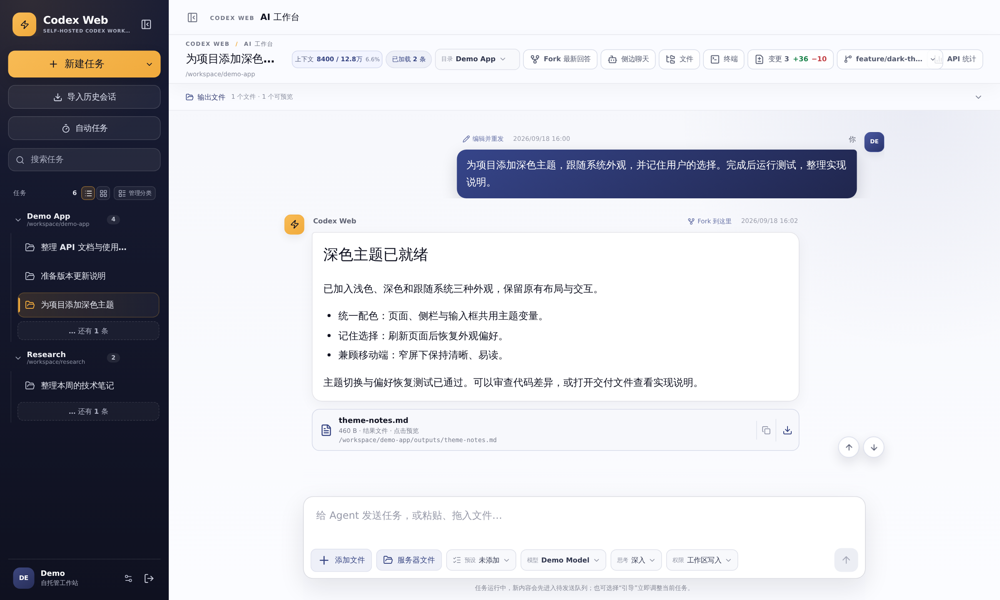
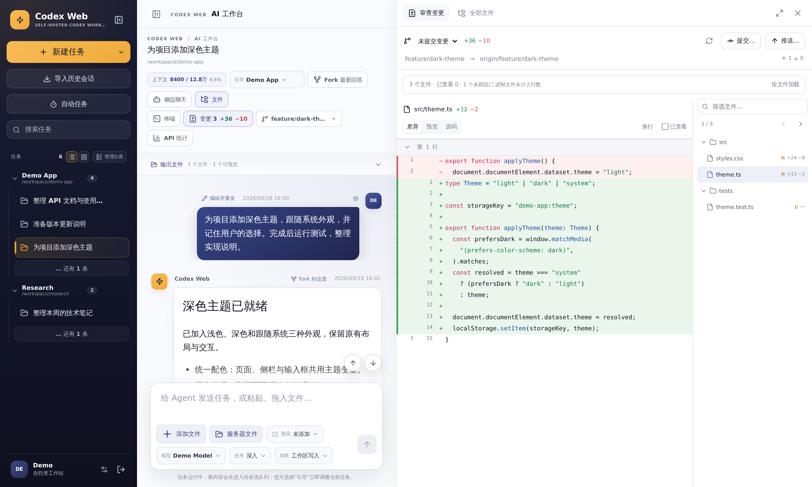
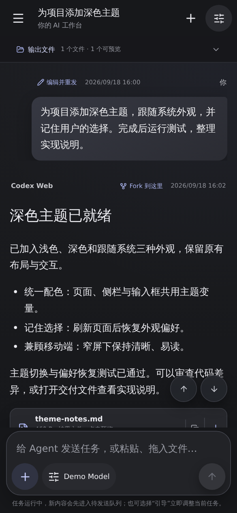

# Codex Web

**在浏览器里使用 Codex 的自托管工作台。**

把需求变成任务，跟进执行过程，审查代码变更，查看交付结果。电脑和手机都能继续同一段工作。

[English](README.md) · [开始使用](docs/DEVELOPMENT.zh-CN.md#快速开始) · [文档导航](docs/README.md)

*截图来自真实应用界面，使用虚构演示数据，不包含真实账户或会话信息。*

## 从需求到交付

1. **选择项目，发起任务。** 在项目目录中打开会话，描述需求，按需附上文件。
2. **跟进执行，继续协作。** 查看进度、排队下一条指令、实时引导当前任务，或通过侧边聊天单独追问。
3. **审查结果，随时续接。** 检查代码差异，预览或下载交付文件，之后回到原会话继续工作。

会话、草稿、附件和排队任务保存在服务器端，而不是浏览器标签页里。关闭页面不会丢失这些内容。

## 一个工作台，减少来回切换

| 你想做什么 | 界面提供什么 |
| --- | --- |
| 管理多个项目 | 按工作目录分组的任务、搜索、历史会话导入与归档。 |
| 连续推进工作 | 持久化任务队列、实时引导、带运行记录的每日自动任务。 |
| 追问而不打断主线 | 独立的侧边聊天，以及指向主对话的上下文引用。 |
| 检查具体改了什么 | 文件树、高亮 diff、Markdown 与源码预览；请求提交或推送前确认范围。 |
| 直接使用交付结果 | 页内文件预览、结果下载和内置终端。 |

## 一边对话，一边审查代码

不离开当前任务就能打开仓库工作区。在 Codex 的说明旁查看文件，比较工作区、暂存区或分支变更。

## 换到手机，继续工作

移动网页版优先展示对话与输入框，任务导航和工具按需展开；支持浅色、深色和跟随系统外观。

另有独立的原生 Android **预览客户端**，不代表已与网页版实现完整功能等价。安装方法与限制见 [Android 说明](docs/ANDROID.md)。

## 自己部署

- **Docker 部署：** 按[快速开始](docs/DEVELOPMENT.zh-CN.md#快速开始)完成配置、持久化存储和 Codex 登录。
- **宿主机部署：** 查看[部署方式](docs/DEPLOYMENT.md)；对外开放前先阅读[安全边界](docs/SECURITY.md)。

需要在服务端配置 Codex 运行环境及其认证；这个项目本身不提供托管 AI 服务。

## 详细文档

原 README 的详细内容没有删除，已移入开发指南，按需阅读。

- [中文开发指南 — 原 README](docs/DEVELOPMENT.zh-CN.md) · [English development guide](docs/DEVELOPMENT.md)
- [全部文档](docs/README.md) — 部署、架构与各项功能说明
- [安全说明](docs/SECURITY.md) · [公开仓库隐私规范](docs/PUBLIC_PRIVACY.md) · [许可证](LICENSE)

---

Codex Web 是围绕 OpenAI Codex CLI 构建的独立社区项目，并非 OpenAI 官方产品，也未获其背书或支持。
