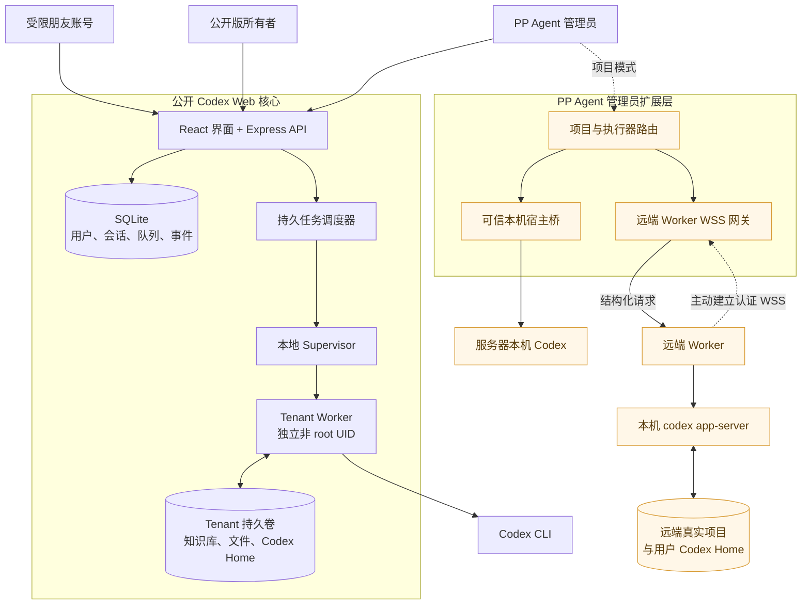
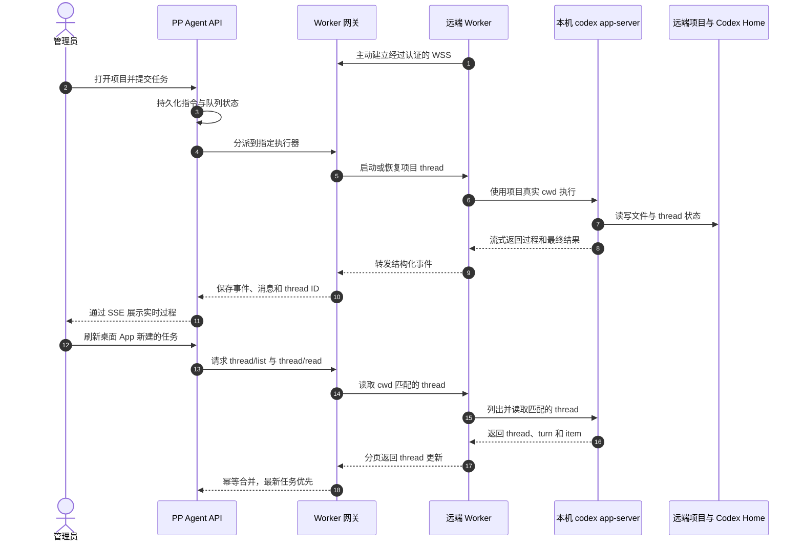
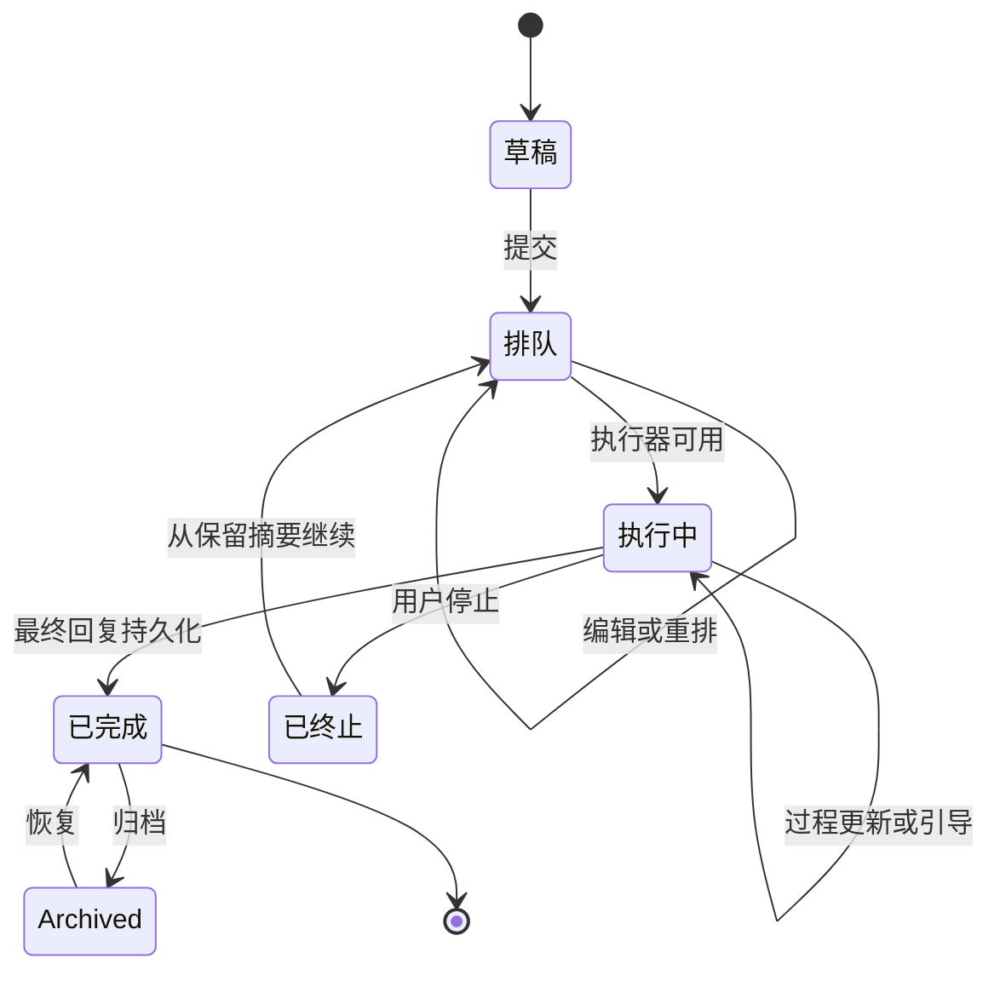

# Codex Web

Web 的 API 统计支持全部历史及自定义起止日期/时间，按浏览器本地时区筛选，包含结束分钟；默认 00:00–23:59 覆盖完整日期。汇总、API 源和模型明细使用同一范围，保存或同步费率后保留筛选。费率设置区域可整体折叠，默认只显示已启用源中的可见模型及可用内置模型；勾选“显示未启用模型”可查看隐藏、停用或已移除模型的既有费率。隐藏不删除历史用量、费率版本或费用；模型启停仍在 API 源与模型管理中操作。“强制重算历史费用”仍影响全部历史，不限于当前筛选。

`android/` 已提供独立的 Kotlin / Jetpack Compose 安卓预览客户端。0.4.2 预览版将悬浮底栏改为 48dp 高的三图标导航，移除文字、外框与选中底色，保留无障碍名称、选中状态、草稿和阅读位置。以对话为首页，支持可折叠的右滑项目任务抽屉、输入框上方队列入口和加密近期浏览缓存；沿用 Web 的视觉与核心逻辑，以原生界面直接连接现有 API，复用服务端草稿、队列、附件和事件流，不使用 WebView 外壳。移动网页版继续独立保留。它不是 OpenAI 官方产品，也不是已完成全部真机与功能等价验收的商业版本。安装、构建、功能矩阵及尚存差异见 [Android 说明](docs/ANDROID.md)。

**当前 Android 发布版：** `0.5.0-preview`（versionCode 12）已发布至维护中的固定下载页，包含统一原生主题、欢迎建议草稿保护、输入状态与阅读优化、当前任务工作台和 Review 本地筛选。安装文件为 `codex-native-android-0.5.0-preview.apk`，已安装同签名 0.4.2-preview 时可直接覆盖升级，无需卸载。见 [发布及验收记录](releases/android/0.5.0-preview.md) 和 [分版本更新计划、PRD、QA](tasks/prd-android-05.md)。

Codex Web 是一个非官方、自托管的 OpenAI Codex CLI 网页工作台。它提供持久化会话、未发送草稿、附件与交付文件、结果文件并排页内预览、服务器端任务排队（排队任务可跳过队列直接执行）、实时引导、可续接的终止/中断记录、会话归档、按时间筛选的批量历史会话导入、完整工作记录、完成任务未读提示、引用提问、历史用户消息编辑并重发、自动命名、用户名与密码自助修改、字号与聊天区宽度调节、默认关闭且可按用户启用的多 API 源与“源 → 模型”二级菜单管理、由 Web 实时事件与本机 CLI/Desktop/VS Code rollout 补记共同组成的 token/缓存命中率/估算费用统计、通过内置任务级 `codex-relay` 接入仅支持 Chat Completions 的模型、预设 Prompt 管理与默认/按对话启用，以及可选的语音转写。源管理说明见 [docs/PROVIDER_MANAGEMENT.md](docs/PROVIDER_MANAGEMENT.md)。

> 本项目由社区独立开发，与 OpenAI 没有关联，也未获得 OpenAI 的背书或支持。

在电脑版网页顶端点击“API 计费统计”，或在手机版打开“会话工具 → API 统计”（也可从个人设置进入），可查看最近 7/30/90/365 天的输入、输出、缓存 token、缓存命中率和按每百万 token 规则计算的估算费用，并按 API 源、模型和客户端拆分。Web turn 通过实时事件记账；后台每分钟增量扫描 Codex rollout，按 thread/turn 去重，只补记实时账本中没有的 CLI、Exec、VS Code、Desktop 或异常中断用量。也可点击“同步本机用量”立即扫描；宿主模式扫描系统用户的 `~/.codex` 和 Web 专用 Codex Home。每个模型均可手动设置谷时未缓存输入、缓存读取、缓存写入和输出费率；用量事件中的输入 token 是总输入量，计费时会先扣除缓存读取和缓存写入 token，再按未缓存输入费率计算，也可启用峰时费率并配置峰时起止时间、星期和 IANA 时区；跨午夜时段同样支持，计费按每次调用的发生时间自动选择峰谷费率。费率修改后，修改前的调用按旧版本计费，修改后的调用按新版本计费；“强制重算历史费用”会清除费率版本记录，并明确让当前费率应用到全部历史用量，适合修正最初设置错误的费率。打开面板时只读取本地计费规则，不会自动请求远程配置；点击“同步远程费率”后才会尝试已启用源的兼容 JSON 计费接口。未配置费率的调用仍保留用量，但不会虚构费用。

每个主会话都可以维护多条持久化侧边聊天：重新打开面板时优先恢复当前主会话最近使用的侧边线程，也可从历史列表切换或新建；面板保持打开时切换主任务不会替换当前侧边线程。侧边聊天使用独立的 Codex thread，可单独选择模型和思考级别；桌面端可拖动左边缘调整宽度，也可引用当前正在查看的主对话上下文。选中主消息文本后点击“侧边提问”，服务端会把引用解析到对应 Codex rollout JSONL，保存相对路径、行号、字节偏移、JSON Pointer、item ID 与字符区间；引用卡可跳回原消息并复制完整定位。选中侧边线程后点击“转为主任务”，系统会保留同一个会话及其历史、草稿、附件、排队任务和 Codex thread，并把它加入任务列表。侧边草稿、消息、排队任务和结构化引用都由服务器持久化，主会话归档、恢复或删除时会同步处理其全部侧边线程。详细设计见 [docs/SIDE_CHAT_DESIGN.md](docs/SIDE_CHAT_DESIGN.md)。

在主对话中，标题栏的“Fork 最新回答”会始终以最新已完成 turn 创建侧边分支；浏览历史时，也可以在任意已完成回答旁点击“Fork 到这里”。系统会复制该 turn 及之前的可见历史，先保存源 thread/turn，侧边聊天首次发送时再通过 `thread/fork` 和 `lastTurnId` 创建独立 Codex thread；主会话原有内容不变。Fork 位置以完成的 turn 为边界，不能切入同一回答内部的字符或工具项。

## Git Review

会话工具中的 **变更**、**环境信息** 和 **文件** 整合为统一仓库工作区：显示当前分支、上游与增删统计，提供可筛选目录树、语法高亮 diff、Markdown 渲染和源码预览；支持工作区、暂存区与分支比较，桌面并排/展开和移动端适配。提交与推送需确认范围后交给当前 Codex 任务执行，沿用账户隔离、持久化队列及审批，不直接绕过执行器修改 Git。使用方式与限制见 [仓库工作区](docs/GIT_REVIEW.md)。

## 快速开始

环境要求：Docker Engine、Docker Compose v2，以及可登录 Codex CLI 的账号。

```bash
cp .env.example .env
npm ci
npm run hash-password -- '请设置一个至少十二位的独立密码'
```

把生成的哈希填入 `.env` 的 `APP_PASSWORD_HASH`，并设置至少 32 个字符的随机 `SESSION_SECRET`。然后执行：

```bash
docker compose up -d --build
docker compose exec --user 11001:11001 \
  -e HOME=/app/tenants/00000000-0000-4000-8000-000000000001 \
  -e CODEX_HOME=/app/tenants/00000000-0000-4000-8000-000000000001/codex-home \
  app codex login --device-auth
```

打开 [http://localhost:37821/codex-web/](http://localhost:37821/codex-web/) 即可使用。队列、附件、会话、归档记录、Codex 线程，以及输入框中尚未发送的正文、引用和附件都保存在服务器端；切换会话、关闭浏览器或换设备后仍可继续编辑。已记录 Codex turn ID 的用户消息可点击“编辑并重发”，系统会从该 turn 之前分叉线程，保留旧分支用于审计但在当前对话中隐藏，然后把修改后的消息排队执行。启用 Codex 的多代理能力后，父线程中的子代理操作与状态也会进入实时工作记录并持久化。

运行中的工作记录不再形成独立的纵向滚动区，而是按照现有记录上限随页面自然展开。排队与运行状态使用不同图标；排队时会显示前方任务数与当前位次（同一工作目录内的任务都会计入）；排队中的任务可以直接跳过队列立即启动，适合确认同目录其他任务不会冲突的场景；任务操作收进稳定的菜单。用户终止任务后，关键执行过程会保留为历史消息；服务意外重启也会明确标记未完成任务，避免把中断误认为完成或自动重复执行；运行中的上游连接中断和限流错误则按有限退避自动重试。容器正常停止时会等待在途任务结束，已排队任务继续保存在服务器。

已完成的会话可以无损归档和恢复；当 Codex rollout 达到 500 MiB 时，界面会提示新建任务以控制超长上下文成本。移动 Safari 使用固定应用外壳，只让内容区滚动。本地 Excel 附件由托管的 openpyxl/pandas 技能处理，详细 Excel 规则只在本轮确实包含对应附件时注入。Apps、连接器、Goals 和多代理能力默认关闭，仅在用户明确提出时启用。

每个任务会维护一个“输出文件”横条，任务生成的 Markdown、代码、配置（JSON/YAML/TOML/XML 等文本类格式）、纯文本、CSV、图片和 PDF 可以在点击文件后于对话窗口右侧展开的并排预览面板中查看；进入任务时不会自动打开文件预览。单条回答包含较多结果文件时，默认优先显示 Markdown 并只展示前 3 项，可在回答下方按批次加载、展开或收起完整列表；用户上传附件仍按原顺序完整展示。输出文件横条也按批次渲染，避免一次性创建过大的 DOM。上传的 `.md` 附件也按扩展名识别为 Markdown，并在同一面板中渲染。文本类预览超过 5 MiB 时会退化为下载，避免大文件占用浏览器内存。

消息中的附件卡片、输出文件横条和预览面板都会显示文件在服务器上的真实路径，并提供一键复制按钮；回复中引用了但未登记为附件的本机文件也会展示原始路径（不可下载），方便定位与手动打开。

对话中出现的“文件:行号”引用（包括行内代码、Markdown 链接与 Codex 文件引用）会渲染为可点击的文件引用；普通代码文件点击后右侧打开代码预览，定位到对应行并展示上下文，向上或向下滚动时会按需懒加载更多代码。没有行号的本地代码文件路径同样可以点击，预览会从文件开头开始展示并向下懒加载；其中 `.md`/`.markdown` 文件即使写成 `文件.md:1`，也会直接渲染为完整 Markdown 预览。

消息列表右下角提供“上一条/下一条我的消息”快速跳转：以当前视口位置为锚点定位相邻的用户消息，更早历史尚未加载时会自动翻页加载直到定位到目标，并短暂高亮该消息。

输出文件预览面板提供临时分享：可一键复制无需登录的预览链接（HMAC 签名、7 天有效，仅限 outputs 下的可预览文件），方便转发给其他人查看。

## 这套工程解决什么问题

Codex Web 是个人 Agent 工作站中可复用、可公开部署的核心。它把一次性的 Codex CLI 交互变成持久服务：即使关闭浏览器，会话、草稿、待发送任务、附件、过程事件、Codex thread ID 和最终文件仍保存在服务器上，换设备后也能继续。

完整的 PP Agent 部署会在这个核心之上增加管理员执行层：朋友或普通成员继续在彼此隔离的 Docker tenant 中运行；管理员则可以按项目明确选择服务器本机执行器，或选择另一台电脑上主动连入的 Remote Worker。为了让公开版本保持安全默认值，本仓库只直接发布低权限核心；管理员宿主桥、项目模式、远端 Worker 网关和生产账号配置属于扩展组件，并不是克隆本仓库后自动启用的功能。

### 账号角色与执行边界

| 角色 | 任务在哪里执行 | 可以访问什么 | 适用场景 |
| --- | --- | --- | --- |
| 受限朋友账号 | Docker 内的非 root tenant worker | 仅自己的会话、知识库、附件、输出和 Codex Home | 允许朋友使用 Agent，但不能接触宿主机或其他用户数据 |
| 公开版所有者 | 同样使用隔离 tenant | 自己的工作区与服务配置 | 本仓库默认的单所有者自托管方式 |
| PP Agent 管理员 | 明确选择的本机或远端项目执行器 | 管理员主动添加的项目及其历史任务 | 管理可信服务器项目，以及已连接电脑上的 Codex |



这里最重要的安全边界是“执行器”，而不只是浏览器账号。受限账号不能把普通 Web 请求变成宿主机访问：任务先经过路径和用户校验，再交给固定 Unix 身份，只能触达自己的 tenant。管理员项目模式则代表一次额外、明确的信任选择，所以它不会混进公开版的默认部署。

### 修改用户名与密码

登录后展开左下角“个人设置”，点击“账户与密码”中的“修改”，在弹出的对话框中即可修改自己的登录用户名与密码。两种修改都需要验证当前密码。新密码至少 12 个字符；修改密码后，其他设备上已登录的会话会立即失效。默认容器/租户部署中，用户名可以自助修改且会持久保存，服务重启不会被 `.env` 里的初始值覆盖。宿主模式（`HOST_MODE=true`）下每个网页用户名对应一个真实系统账户，因此用户名不能在网页修改，只能在这里修改网页登录密码；系统账户密码请使用 `passwd` 等系统工具管理。

### 管理远端电脑上的 Codex

Remote Worker 不开放入站 Shell、远程桌面或通用隧道。它主动向服务器建立应用层 WSS 连接，只处理已注册项目的结构化请求。Codex 仍以那台电脑的交互用户运行，`cwd` 是真实项目目录，Codex Home 也是该用户原有目录，因此网页发起的 thread 与桌面 App 发起的 thread 可以共享同一套本机 Codex 历史。



远端同步是显式操作，而不是伪装成分布式文件系统。服务端通过 thread、turn 和 item ID 幂等合并；电脑离线时历史仍然保留，新任务等待执行器恢复。项目归档只做隐藏，不删除任务；归档期间停止显式同步，以后重新添加同一执行器上的同一文件夹即可恢复原历史，并可使用新名称。

### 持久任务生命周期

浏览器只是控制界面，不持有任务真相。草稿和附件在发送前就可以保存；排队任务可以编辑、重排、删除，也可以转为对当前任务的实时引导；已创建为排队任务的工作可以在确认后跳过队列直接开始执行。不同会话可以并行，同一会话保持串行。过程事件会压缩为有上限的工作记录，同时保留重要阶段反馈；工作记录随主页面展开，最终回复保存后过程卡片自动消失。



工程把持久状态分成四类：

- SQLite 应用状态：用户、Session、会话、消息、草稿、任务、事件、排序和 thread 引用；
- Tenant 知识与文件：每个用户自己的长期知识、上传、输出和不可变交付文件；
- Codex 状态：保存在对应执行器 Codex Home 中的登录信息与 thread 历史；
- 运行时状态：每个任务独立的临时目录和进程，服务重启后可以从持久状态恢复。

公开版 Web 进程没有 Docker socket、宿主文件系统挂载或 root bridge。准备根据扩展架构搭建自己的管理员与远端执行能力前，请先阅读[架构说明](docs/ARCHITECTURE.md)和[安全说明](docs/SECURITY.md)。

## 宿主模式与自定义工作目录

宿主模式（`HOST_MODE=true`，不使用 Docker 直接在机器上运行）下，每个系统用户对应一个 Codex Web 账号，任务以该用户身份运行，并可访问其本机工具；Codex 配置、凭据和会话状态使用 `TENANT_ROOT/<user-id>/host-codex-home`，首次从 `~/.codex` 独立复制，之后 Web 的源管理和登录更新不会写回桌面端目录。Codex 固定使用 `workspace-write`、`approval_policy = "on-request"` 与 `approvals_reviewer = "auto_review"`：选定工作目录、对话工作区和租户资料库可直接写入，需要额外权限的操作由自动审核器决定，网页用户无需手工批准，无法自动处理的审批默认拒绝。此时新建任务可以选择 Codex 的工作目录：从收藏的常用目录中快捷选中、用文件目录浏览器直接浏览机器文件系统，或手动输入机器用户可访问的任意绝对路径。添加附件时也可以打开同一个浏览器直接选择机器上的文件，选中的文件会复制到对话自己的隔离工作区。收藏列表与每账号默认目录保存在网页数据库中，每个对话也会记住自己的工作目录。
宿主模式（`HOST_MODE=true`，不使用 Docker 直接在机器上运行）下，每个系统用户对应一个 Codex Web 账号，任务以该用户身份运行，并可访问其本机工具；Codex 配置、凭据和会话状态使用 `TENANT_ROOT/<user-id>/host-codex-home`，首次从 `~/.codex` 独立复制，之后 Web 的源管理和登录更新不会写回桌面端目录。Codex 默认使用 `workspace-write`、`approval_policy = "on-request"` 与 `approvals_reviewer = "auto_review"`：选定工作目录、对话工作区和租户资料库可直接写入，需要额外权限的操作由自动审核器决定，网页用户无需手工批准，无法自动处理的审批默认拒绝。若管理员在 `.env` 设置 `ALLOW_DANGER_FULL_ACCESS=true`，每个对话还可以在输入框上方的“权限”菜单中选择 Codex 的 `danger-full-access`：该模式完全跳过沙箱，Agent 拥有该账户完整的文件系统与 Shell 权限且不再经过自动审核，请仅在信任所有用户与任务内容时开启。此时新建任务可以选择 Codex 的工作目录：从收藏的常用目录中快捷选中、用文件目录浏览器直接浏览机器文件系统，或手动输入机器用户可访问的任意绝对路径。添加附件时也可以打开同一个浏览器直接选择机器上的文件，选中的文件会复制到对话自己的隔离工作区。收藏列表与每账号默认目录保存在网页数据库中，每个对话也会记住自己的工作目录。

宿主模式下任务进程会加载系统用户的完整补充组（通过 util-linux 的 `setpriv --init-groups` 降权），因此任务 shell 与正常登录一样能访问组权限工具（例如 `htmlmounts`）；缺少 `setpriv` 时自动回退到仅设置主 UID/GID 的旧行为。

附件上传、生成的交付物和临时运行文件仍然位于对话自己的隔离工作区；删除对话不会删除所选宿主目录。指向同一目录的任务会串行执行，避免并发写入同一个项目仓库。默认隔离租户部署中该功能不可用。

任务打开后，右上角“文件”按钮会打开侧边文件树。它可懒加载浏览当前会话工作区、资料库，以及 host 模式下当前会话选定的工作目录；点击文本、Markdown、图片或 PDF 文件即可在侧栏内预览。文件树当前为只读功能，不提供删除、重命名或移动文件操作，并会隐藏运行时目录和常见凭据文件名。

把已有会话切换到其他会话正在排队或运行任务的目录时，页面会先要求确认；确认后即可切换，同一目录的任务仍保持串行执行。

宿主模式默认只监听 `127.0.0.1`。需要从局域网访问 Web 界面时，可在 `.env`
设置 `HOST=0.0.0.0` 与 `ALLOW_HOST_PUBLIC_BIND=true`；这会暴露到所有网卡，
在没有 TLS 的情况下密码与会话 Cookie 以明文传输，只建议在可信局域网使用，
优先用监听回环的反向代理 + HTTPS。响应头默认不带 `upgrade-insecure-requests`
（CSP）也不发送 HSTS，纯 HTTP 局域网部署下前端资源不会被强制升级为 HTTPS。

左侧任务列表会按工作目录自动分类：独立工作区各成一类，已收藏目录与未收藏目录都会按目录各自成一类（未收藏目录以目录名显示）。你可以创建自定义分类、把某个目录连同其全部任务移入自定义分类、置顶分类并调整置顶顺序，也可以隐藏暂时不想看到的分类；分类定义、目录归属、置顶顺序和隐藏分类保存在服务端，分类展开/折叠状态与电脑端侧栏显示状态保存在浏览器。电脑端可通过顶部栏的侧栏按钮隐藏或恢复左侧任务列表。隐藏的分类可以在“管理分类”中恢复显示。分类操作菜单里可以直接在对应分类的工作目录下新建任务；自定义分类关联多个目录时会先让你选择其中一个目录。未主动拖动时，每个分类内的任务按最近活跃时间从新到旧排列；长按任务后拖动可以选择持久化的自定义顺序（普通上下滑动仍用于滚动列表），保存顺序之后新建的任务仍会显示在该分类顶部，不会被旧顺序挡住。新版本首次启动会清理旧版本可能由误触产生的分类任务顺序一次，之后主动拖动仍会保存。任务列表支持“竖列列表”与“多宫格”两种视图：多宫格下每个格子是一个分类及其任务，分类按优先级从左上到右下排列——第一行从左往右铺满，之后每个卡片放入当前高度最小的列（高度相同时取最左侧），不同高度的卡片不再被强制对齐成整齐的行；点击格子内“还有 N 条”即可展开查看全部任务，展开后“收起为最近 X 条”回到该分类的收起条数；按住这个按钮上下拖动可以逐条调整每个分类展示的任务数量，拖动结果按分类保存在浏览器。视图选择同样保存在浏览器。多宫格下如果一屏放不下所有分类卡片，卡片会自动按可用高度增加列数；列数受侧栏宽度限制，宽度不足以多列时回退为纵向滚动。

## 可选语音输入

本地模式：部署独立 CPU 语音服务并设置 `TRANSCRIPTION_PROVIDER=local`。主输入框及侧边聊天支持使用时选择 **SenseVoiceSmall INT8** 或 **Qwen3-ASR-0.6B**；当前浏览器按用户名记住上次选择。桌面语音选择框与模型、思考等级同排；App将选择框收进“任务选项”，输入栏仅保留发送旁的一个语音按钮。再次点击语音按钮仅转写回填，录音中点击发送则识别成功后合并最新草稿并发送一次；失败、空结果或取消不发送。模型准备、离线迁移、服务管理和限制见 [本地语音部署](docs/LOCAL_VOICE.md)。本地服务只接收录音和模型选择，不接收草稿、附件或对话内容，也不会失败后改用云 API。

本地识别不需要付费 Key 或公网地址，但麦克风仍需 HTTPS 或 localhost。设置 `TRANSCRIPTION_PROVIDER=disabled` 可关闭全部语音输入。

可选云端兼容模式：设置 `TRANSCRIPTION_PROVIDER=dashscope`、你自己的 `DASHSCOPE_API_KEY` 和 HTTPS `PUBLIC_BASE_URL`。默认使用 `qwen3.5-omni-plus`，可通过 `DASHSCOPE_ASR_MODEL` 修改；该模式未设置 Key 时关闭。未配置 `TRANSCRIPTION_PROVIDER` 的旧部署继续按云端设置判断是否启用。

仅云端模式使用额外拼写/话题上下文，默认限制为约 500 token，由草稿、附件名、文本附件开头 16 KiB、最近对话、固定技术词和最多两张小图片共同分配；未发送的大文件不会整份进入转写请求。可通过 `TRANSCRIPTION_CONTEXT_TOKEN_BUDGET`、`TRANSCRIPTION_CONTEXT_MAX_IMAGES` 和 `TRANSCRIPTION_CONTEXT_MAX_IMAGE_BYTES` 调整。

公网部署请配置 HTTPS；浏览器通常只允许在 HTTPS 或 localhost 页面调用麦克风。

更多信息请参阅 [部署说明](docs/DEPLOYMENT.md)、[架构说明](docs/ARCHITECTURE.md) 与 [安全说明](docs/SECURITY.md)。

## 交互式终端

点击任务工具栏中的**终端**，在聊天区下方展开自动连接的 Bash PTY 停靠栏，不使用悬浮窗口或遮罩，不需要启动按钮或操作工具栏。输出改用事件唤醒的长轮询，支持键盘快捷键、交互程序及自动断线重连。命令以映射的非 root 系统/租户账户直接执行，**不经过 Codex 沙箱审批**。收起终端栏保留会话，输入 `exit`、按 Ctrl+D 或 30 分钟无请求后回收；服务重启不保留 shell 状态。安全边界、限制和部署要求见 [Web 终端](docs/TERMINAL.md)。
